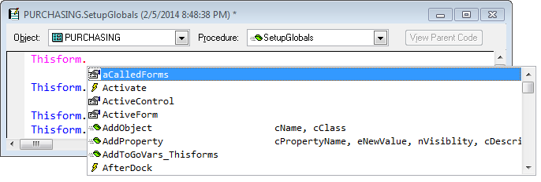
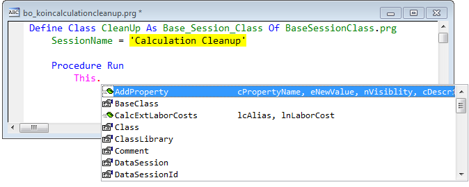
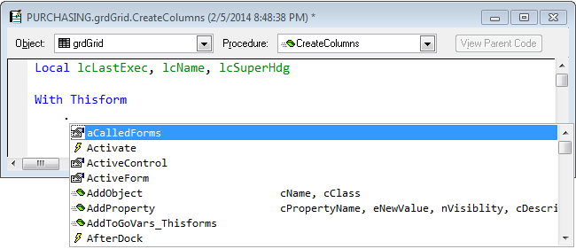
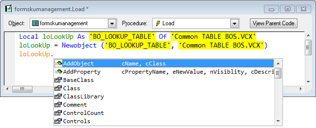
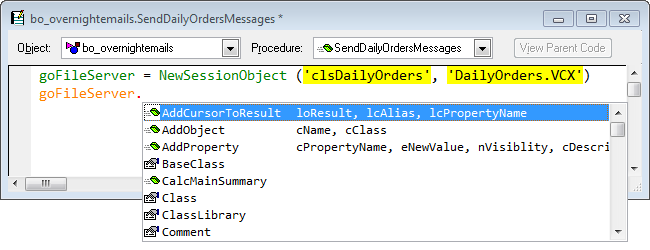

Thor TWEeT #14: IntellisenseX for Objects
===

IntellisenseX provides dropdown lists of properties, events, and methods (PEMs), similar to what is provided by default Intellisense, for all the cases provided by default Intellisense as well quite a few other cases as well.

This TWEeT addresses the following topics about IntellisenseX for Objects

*   In SCXs and VCXs
*   In PRG-based classes
*   Ctrl-Enter to paste in parameters list
*   Inside WITH/ENDWITH structures
*   In LOCAL Statements
*   After NEWOBJECT or  CREATEOBJECT
*   After UDFs that create objects
*   With loObject
*   Using the Custom Keyword List

#### In SCXs and VCXs

In SCXs and VCXs, IntellisenseX provides a drop down list for objects referenced by THISFORM or THIS that is very similar to that given my default Intellisense:

#### In PRG-based classes

IntellisenseX provides drop down lists for THIS and WITH THIS inside PRG-based classes.

On the options page on the Thor Configuration form you can indicate the level of detail you want to see (either custom properties and methods in this class only, or all inherited properties and methods)

#### Ctrl-Enter to paste in parameters list

As can be seen, the display has a second column, showing the parameters list for methods and events.

If you select an item from the list and press Ctrl+Enter, the parameters list will be inserted into your code, as shown below. This is not necessary when default Intellisense provides the Quick Info window for parameters but is of considerable value for the cases (described below) where IntellisenseX provides assistance where default Intellisense does not.

#### Inside WITH/ENDWITH structures

IntellisenseX provides drop down lists inside WITH/ENDWITH structures for a variety of cases not supported by default Intellisense, including WITH THISFORM, WITH THIS.PARENT, and embedded WITHs.

#### In LOCAL Statements

IntellisenseX now recognizes objects identified in LOCAL statements (as default Intellisense does).

#### After NEWOBJECT or  CREATEOBJECT

IntellisenseX also recognizes objects created by NEWOBJECT or CREATEOBJECT even if there is no corresponding LOCAL statement. This can be quite handy when first writing a procedure.

#### After UDFs that create objects

IntellisenseX also provides a [Plug-In](Thor_add_plugins.md) (named “NewObject”) that allows it to recognize when you have called a UDF that creates an object. In the example below, my personal use of the plug-in allows Intellisense to recognize my use of a UDF named NewSessionObject (which happens to use the same parameters as NEWOBJECT, but this is not necessary).

For specifics of the use of this Plug-in, see [IntellisenseX Customization](Tweet_18.md).

#### With loObject

Finally, when you have objects defined by any of the examples noted above, IntellisenseX will work on that object when referenced after WITH, as shown below.

#### Using the Custom Keyword List

The default behavior from IntellisenseX when presenting names of properties, methods and events in SCXs and VCXs is to use _MemberData to use the correct case for presenting the names. This can be quite slow.

For PRG-based classes, the default behavior is to use the correct case from custom properties and methods in the class, and upper case for all inherited properties and methods.

As an alternative, you can create a [Custom Keyword List](Tweet_16.md), a global table used by IntellisenseX and other Thor tools. This table contains a list of all the “keywords” (field names, property names, object names, and any other kind of name) for which you want to indicate how the case of the name should be presented. (For example, see  “CalcMainSummary” in the example directly above.)  This provides a consistent way for handing the case of the names throughout your applications.

See also [History of all Thor TWEeTs](TWEeTs.md) and [the Thor Forum](https://groups.google.com/forum/?fromgroups#!forum/FoxProThor).
