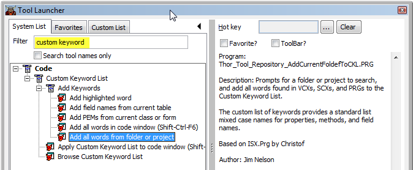
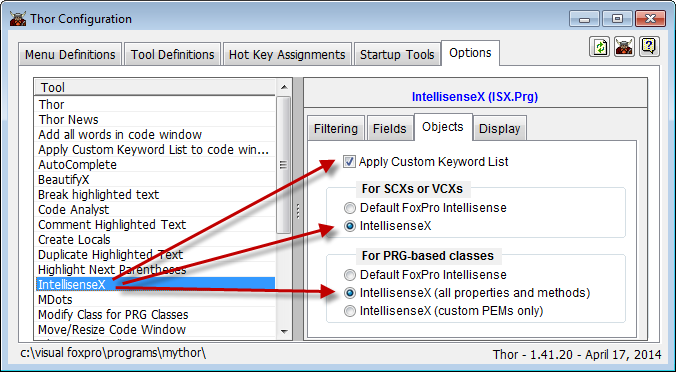
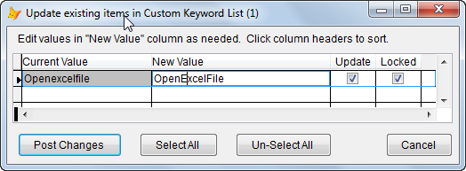

Thor TWEeT #19: Deficiencies in [IntellisenseX](https://github.com/VFPX/IntelliSenseX)
===

### (and how to avoid them)

### … The Custom Keyword List …

The most serious problem with IntellisenseX is that it is SO SLOW when getting the list of properties and methods in a VCX or SCX.  The process of getting the correct case for names in a VCX/SCX, requiring parsing MemberData in parent class(es), takes more time than anybody would be willing to wait each time you enter THISFORM followed by a dot.

There is a similar problem when working in PRG-based classes where the parent class is anything other than a FoxPro base class. There is no good way to obtain the correct case for inherited names (PRG-based classes don’t even use MemberData), so all inherited custom names end up in lower case.

The remedy for these two problems is the same – the Custom Keyword List.  This is just a simple table with the list of all words from your programming universe, where each word is saved with the mixture of upper/lower case that you prefer. This table can be created easily, updated automatically, and applied to any block of code.  Not only does this eliminate the problems mentioned above, it ensures that your words are always used consistently (same upper/lower case).

#### Getting Started

First, create the Custom Keyword List by running Thor Tool _Add all words from folder or project._ (You can find all the tools referenced here by filtering on “Custom Keyword” in the Thor Launcher.)



This tool will run for a few minutes as it scours an entire folder or project for all programming words.  Eventually, a form will come up showing you the list of all words in found. You can do some editing of the list, but for starters the suggestion is to simply save everything.

Next, go to the options page for IntellisenseX in the Thor Configuration form to select the settings such that IntellisenseX will use the Custom Keyword List.



Finally, mark these checkboxes for option “Add all words in code window” as well, so that new words you create going forward, including properties and methods created by [PEM Editor](https://github.com/VFPX/PEMEditor) or any of its related tools, are automatically added to the Custom Keyword List. Do so even if you don’t used BeautifyX (but more on that in a bit).


After performing these three steps, you’re on your way.

#### Updating the Custom Keyword List Programmatically

You can programmatically add words to this list at any time by using any of the following Thor tools:

*   _Add all words from folder or project_
*   _Add all words in code window_
*   _Add PEMS from current class or form_
*   _Add fields names from current table_

If there are any new words encountered, a form opens for you to approve the new words; if there are any words found that conflict with words already in the table, a separate form opens for you to select which you want to use.



#### What does “Locked” mean?

Some words may have inconsistent usages – “Openexcelfile” or “OpenExcelfile” or “OpenExcelFile” or ?  Marking a word as “Locked” indicates that that is your preferred usage and you will never be asked about possible conflicts again.

#### Updating the Custom Keyword List Manually

You can  use the tool _Add highlighted word_ to add or update a word directly to the Custom Keyword List (this also marks it as Locked – your preferred usage).

You can also open the table with tool _Browse Custom Keyword List_ and make any modifications as needed. This table is found in your “My Tools” folder.

```foxpro
_Screen.cThorFolder + 'Tools\My Tools\KeywordList.DBF'
```


#### Using BeautifyX

If you’re not already using Thor tool BeautifyX all the time, it’s time to change.  It provides a wide range of features and you can choose which ones work for you – but some of them them definitely will.

The options include

*   Apply native Beautify
*   Provide consistent spacing around operators and commas, align semi-colons, indentation for continuation lines
*   Highly customizable formatting for SQL-SELECT, SQL-UPDATE, SQL-DELETE, and REPLACE statements, (conditionally within TEXT / ENDTEXT structures)
*   Run Thor tool “Create Locals’
*   Add MDots
*   Check for RETURNs between WITH/ENDWITH (these create latent C5 errors)
*   Apply Custom Keyword List
*   Add words to Custom Keyword List.

Make it your practice to use BeautifyX on all the code you write.

See also [History of all Thor TWEeTs](TWEeTs.md) and [the Thor Forum](https://groups.google.com/forum/?fromgroups#!forum/FoxProThor).
