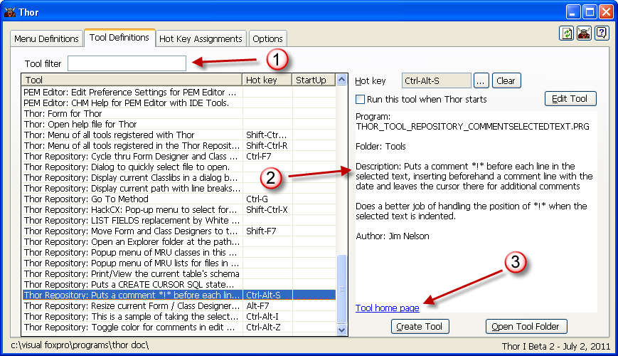

### Browsing the list of tools

The second page (**Tool Definitions**) of the Thor form displays a grid showing all of the tools registered with Thor as well as what hot keys (if any) are assigned to them.  It can also be used to assign hot keys, to edit existing tools, and to create new tools.

The grid on the left shows all the tools registered with Thor. grouped by their _Source_.  Thus it is recommended that when you create your own tools, you assign the same _Source_ to all of them, so they will all be grouped together there (and in other places in Thor.)

The second column shows the hot key that you have assigned to each tool, if any.

The third column shows the tools that you have chosen to be run each time that you run Thor.  While this is in fact meaningless for most tools, it may be found desirable for those tools that bring up forms that you want to remain visible throughout your IDE session (such as PEM Editor, Document TreeView, or Object Size and Position)

There are a few other features to note when browsing this page:

# You can use the Tool filter to narrow the list of tools shown.  Note that the filter is only applied when you exit the field.
# Most of the tools from PEM Editor and the Thor Repository have (or will have) more complete descriptions that appear in the large editbox on the right.  A reasonable approach when starting as a new user of Thor, or when getting a new collection of tools from the Thor Repository, is to step through all the tools, reading the descriptions for each.
# A number of tools, including most of the tools from PEM Editor, have (or will have) a link to the tool's home page for a thorough description of its use.  

**See also**
* [Assigning hot keys to tools](Thor-assign-tool-hot-keys)
* [Editing existing tools](Editing-existing-tools)
* [Creating new tools](Thor-Creating-New-Tools)
* [Tools to make tools](Thor-Tools-Making-Tools)
