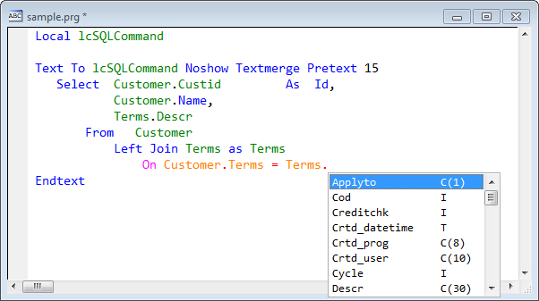
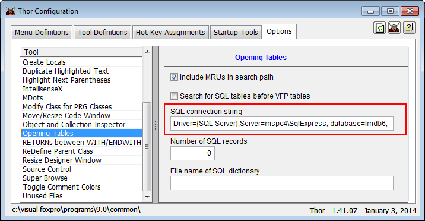

Thor TWEeT #10: IntellisenseX: Field Names from SQL Server Tables
---

IntellisenseX now supplies field names from your SQL Server tables, as shown in the following example:



What your are seeing is a dropdown list of field names from an SQL table named “Terms”. It may occur to you that this looks exactly like the list from a VFP table.  You would be completely correct, as IntellisenseX now gives you field lists from ***both*** FoxPro tables and SQL Tables, and both are accessed the same way.

You need follow only a few steps  to activate this:

1.  Open the Thor Configuration form
2.  Go to the Options page
3.  Click on “Opening Tables” on the left
4.  Enter your connection string on the right



If you read no further, you have all you need to know to get started using IntellisenseX on SQL tables; what remains in this article is a discussion of the finer points.

#### IntellisenseX recognizes aliases within an SQL statement

As shown below, aliases within an SQL statement are handled as desired.


But something unexpected will occur because you will probably refer to the aliases in the list of fields, at the beginning of your SQL statement, before you have specified the aliases. The way around this is to create your statement in sort of an inside-out fashion – that is, create your FROM and JOIN phrases first (or, at least as much of them as necessary to create the aliases) and then you’ll have the IntellisenseX support when specifying the field list.


See also the example further on showing how to access aliases in a plain VFP Select statement (that is, not within a Text/EndText structure).

#### How does this work, anyway?

When you invoke IntellisenseX, it goes through a lot of hoops to determine whether the name immediately before the dot could refer to an object or an open table/cursor/view. If none of those apply, it then tries to do you a favor and open the table/view for you. (This has been true from day one).

What has been added is that if you supply a connection string (as previously noted), it will also try to read at least the structure from your SQL table. In doing so, it creates a cursor (with “_SQL4ISX_” prefixed to the name of your SQL table) which can be used by IntellisenseX. (See also the discussion below about how this applies to other tools, such as [**SuperBrowse**](Thor_superbrowse.md).)

#### <a name="SQLDictionary"></a>What is that “SQL Dictionary” referred to on the options page? <!-- TBL: Check anchor -->


An alternative method to using a connection string (which accesses the table each time) is to create a local VFP table with a list of all fields from all your SQL tables.  The statement below creates a table with the desired structure.  (You can expand the first two character fields as needed.)  To create the entries in this table, you can use SQLTables() to get a list of all tables and SQLColumns() on each table to get the list of fields.

```foxpro
Create Table MySQLTableName ( ;  
    XTABNAME     C(40),       ;  
    FIELD_NAME   C(30),       ;  
    FIELD_TYPE   C(1),        ;  
    FIELD_LEN    N(3),        ;  
    FIELD_DEC    N(3))
```


#### What if a single connection string is not enough?

There is no provision currently to make it easy to switch between different SQL databases, which would  require multiple connection strings. However, it is possible to change the connection string programmatically, by executing the following:

    Execscript(_Screen.cThorDispatcher, 'Set Option=', 'Connection String', 'Opening Tables', NewConnectionString)

and this could be used in a Thor tool to select which database to read from.

#### Does any of this apply to other tools?

There are a number of other tools (most notable [**Super Browse**](Thor_superbrowse.md)) which use the same sub-routine for opening tables as is used by IntellisenseX. Thus, if you use Super Browse to help you create a list of fields for an SQL statement, you can click on the name of the table (be it a VFP table or SQL table) and execute Super Browse and away you will go.

#### How do you use aliases in SELECT statements not inside a Text/EndText structure?

The strategy for using IntellisenseX to provide field names for aliases in a SELECT statement (as explained above) is the same when not inside a Text/EndText structure , but with one additional consideration.

Inside a Text/EndText structure, the end of the statement is clearly identified by the keyword “EndText”. In a plain VFP statement, however, there is no such clear ending, so IntellisenseX must rely on the use of the semi-colon to show continuation lines. Thus, the rule that is followed is that the line where you are typing is assumed to have a semi-colon (because you haven’t gotten to the end of the line yet) and the SELECT statement continues through the following lines until one is reached that does not end in a semi-colon.


See also [History of all Thor TWEeTs](TWEeTs.md) and [the Thor Forum](https://groups.google.com/forum/?fromgroups#!forum/FoxProThor).
