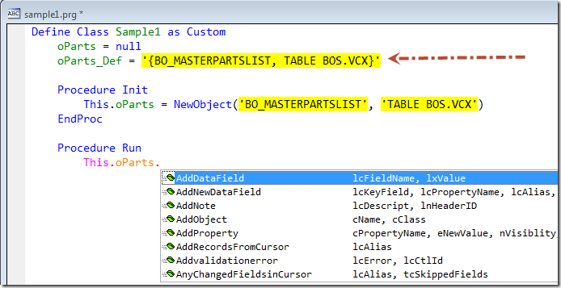

Thor TWEeT #18: IntellisenseX for Nested Objects
===

IntellisenseX provides dropdown lists for nested objects. These dropdown list are available throughout an entire form or class, as shown in this example:

The key to making this work is to define a property that can used by IntellisenseX to determine the dropdown list. 

The name of the property is the name of the nested property (“oParts” in the example above) with “_Def” added as a suffix.

The value of the property is basically the same as used for Local Aliases (which apply only to the current procedure; see [Using Local Aliases in IntellisenseX](Tweet_17.md)) or for Global Aliases (which apply everywhere; see [the Alias Dictionary](Tweet_15.md)). It can be any one of a number of things, referring to either tables or objects.

*   A table, cursor, or view name
*   The full or relative path name to a table
*   The name of an SQL table
*   A reference to class from a class library; thus,  “`{class, classlibrary}`“  _See note below for Forms and VCX classes._
*   A reference to class using the same syntax as the LOCAL command; thus,  “`Local loPAL as PAL of BO_PAL.VCX`“
*   A reference to an object; thus,  “`Thisform.oParts` “
*   An executable expression that returns an object or the name of an table, cursor, or view. This executable must start with an “=”; thus, something like “`= MyGetObject(‘Parts’)` “.  _See note below for Forms and VCX classes._

> _An unexpected problem arises when when using the Property Sheet or PEM Editor to set the values for the two items noted above – values inside curly braces are converted to dates, and values beginning with an = sign are saved as expressions. To avoid these issues, prefix the values with && – thus:_
> 
> *   “`&& {class, classlibrary}`“
> *   “`&& = MyGetObject(‘Parts’)` “

This table shows a number of different values that can be used for the value of the “_Def” property:

Value|Description
---|---
“PartsList”|The name of a table in the path, in the Data Environment of a form, in an open DBC, in the MRU list for tables, or the name of a table in a SQL Server database. It can also be opened by the plug-in “Open Table”.
“..\Tables\PartsList”|The absolute or relative path to a table.
“{NISDetailsForm, NIS.VCX}”|A class in a VCX or PRG
“Local loPAL as PAL of BO_PAL.PRG”|An alternative way to reference a class. This syntax was chosen so that you can copy the LOCAL command directly from a line of code.
“ = GetBusinessObject(‘TableName’)”|A call to your own UDF that returns an object; used, for instance, if you use a factory to return objects instead of direct references.

Nested objects may take any of a number of forms, including:

*   `ThisForm.oBusObj`
*   `This.oData`
*   `This.oPartsList.oData`
*   `This.oBusObj.oPartsList.oData`

Nested objects may appear in forms, VCX-based classes, and PRG-based classes and there can be multiple levels of nesting.

This TWEeT has addressed Aliases that apply to an entire form or class (both VCX and PRG-based).  Earlier TWEeTs have addressed [Local Aliases](Tweet_17.md) and [the Alias Dictionary](Tweet_15.md) addressed global aliases.

An upcoming TWEeT will describe plug-ins that be used to handle cases that these features do not.

See also [History of all Thor TWEeTs](TWEeTs.md) and [the Thor Forum](https://groups.google.com/forum/?fromgroups#!forum/FoxProThor).
