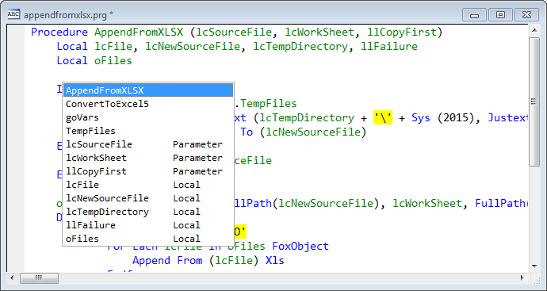
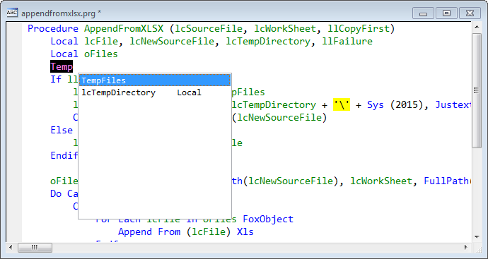
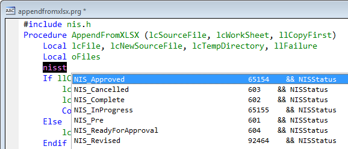

Thor TWEeT #22: Related [IntellisenseX](https://github.com/VFPX/IntelliSenseX) Tools
===

There are a number of Thor tools other than [_IntellisenseX_](https://github.com/VFPX/IntelliSenseX) that provide dropdown lists of names to select from.  These are not the familiar lists that native FoxPro Intellisense provides (member names or field names), but rather other lists that make sense in your FoxPro IDE.  These lists are not activated by pressing the dot (like IntellisenseX), so you will need to access them another way (by assigning a hot key or by adding them to the Thor toolbar or a menu)

These tools can be found using the Tool [Launcher](Thor_launcher.md):

The dropdown lists provided by these tools are:

*   _AutoComplete_ – All names referenced in the current procedure, except for VFP Keywords. Thus, variables, field names, table names and aliases, procedures, objects, property and method names, and so on
*   _Dropdown Constants List –_ All constants defined in the current procedure (#Define statements) as well as all constants defined in referenced #Include statements.
*   _Dropdown Procedures List –_ All procedures and functions referenced in either the current project (if there is one open) or the current path.
*   _Dropdown Table Names –_ All tables in the current path.
*   _DBC Tables by ! –_ All tables found in a DBC.

All of these tools work essentially the same way. When you invoke them, you get a dropdown list that you can select from, just as when you select from dropdown lists created by IntellisenseX. The following example demonstrates a use of _AutoComplete_, showing all the names referenced in this procedure.

You can also begin typing part of the name before invoking the tool, such as in this example where “Temp” was entered before invoking _AutoComplete_.

Finally, if you type in enough of a name to uniquely identify it (such as “New” in this example, which matches only “lcNewSourceFile”), the match is pasted in immediately without even showing the pop-up.  When this becomes familiar, it is extremely handy, reducing both keystrokes and keying errors.

There are a few things to note about each of these tools:

*   _AutoComplete_ – has its own plug-in to allow you to change the names that are displayed or their order. (My personal version of this recognizes my convention for naming tables and cursors).
*   _Dropdown Constants List –_ The dropdown list shows not only the names of matching defined constants, but also their values and any comment on the same line.  Furthermore, the matching is also done against the comments as well. For instance, in the example below, entering “nisst” matches all the entries that have “NISStatus” (a field name) in the comment.

*   _Dropdown Procedures List –_ shows the names of procedures and functions, but not their parameters. Though that was the original intent,  including the parameters caused it to be so slow it was worthless.  Even as it is, without parameters, it can be very slow.
*   _Dropdown Table Names –_ has its own plug-in to search in different folders, etc.
*   _DBC Tables by ! –_ This one is not quite like the others, as it assigns an On Key Label for when you enter the ‘!’. Thus, you can only use this tool that way (not from menus or the Thor Toolbar, for instance)

See also [History of all Thor TWEeTs](TWEeTs.md) and [the Thor Forum](https://groups.google.com/forum/?fromgroups#!forum/FoxProThor).
