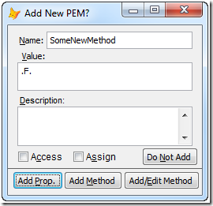

Thor TWEeT #27: Go To Definition
===

_Go To Definition_ is one of the most useful Thor tools at the same time as being one of the easiest to use.  If it had been brought into existence as a separate VFPX project instead of simply coming along with PEM Editor and then Thor, it would certainly have achieved the much wider recognition and use that it deserves.

It allows you to point to any user-defined name in your code, and go to (that is, display and/or edit) its definition. It can also be used to create new methods and properties in a form or class.

The mechanics are simple:

1.  Click on the name (right before the name, inside, or just after).
2.  Run _Go To Definition_. (_Suggestion: use a convenient hot key; I use F12)_

This table lists all the different types of names that can be searched for:

Type of Name|Action taken
---|---
Method or event|Opens up the method for editing; if there is no local non-default code, also opens up a txt file containing all the inherited code for the method.
Object|Selects that object, if possible, for display in PEM Editor and property window.  There are some conditions where this fails: If the object is hidden beyond other objects or not otherwise visible or if it is on a different page of a pageframe.
Property|Same as selecting an object, but also tries to select that property in the PEM Editor grid.  This only works if the PEM Editor form is open, and may also fail based on the filters in effect in the grid.
DODEFAULT|Opens up a txt file containing all the inherited code for the method.
PRG|Opens the PRG.
Procedure or Function in a PRG|Opens the PRG and highlights the start of the PROC or FUNC
Constant (#Define …)|Opens the #Include file, and highlights the constant
Form|Opens the form
Report|Opens the report
Fully highlighted file name|Opens the file for editing; should work for all file extensions.
Class Name|Opens the class, whether it is in a VCX or PRG
CREATEOBJECT or NEWOBJECT|Opens the class, whether it is in a VCX or PRG
LOCAL loObject as someclass of somelibrary|Opens the class (when you click on “LOCAL”)
{{ loObject = { someclass, someclasslibrary } }}|Opens the class (when you click on “loObject”)
Define Class xxx as xxxParent (of xxxLibrary)|Opens the parent class xxx Parent (when you click on “Define”)

If the search is to be conducted looking in file(s) other than the form or class being edited, the files in the active project, if any are searched; if there is no active project, then all files in the path are searched.

#### Creating New Properties and Methods

_Go To Definition_ can also be used to create new properties and methods. Simply call Go To Definition when the cursor is in the name of a potential new property or method and the form for creating new properties or methods is opened.

_Personal note: I rely heavily on this tool. In fact, I use it to create most of my new properties and methods, rarely using PEM Editor for that purpose any more._

See also [History of all Thor TWEeTs](TWEeTs.md) and [the Thor Forum](https://groups.google.com/forum/?fromgroups#!forum/FoxProThor).
